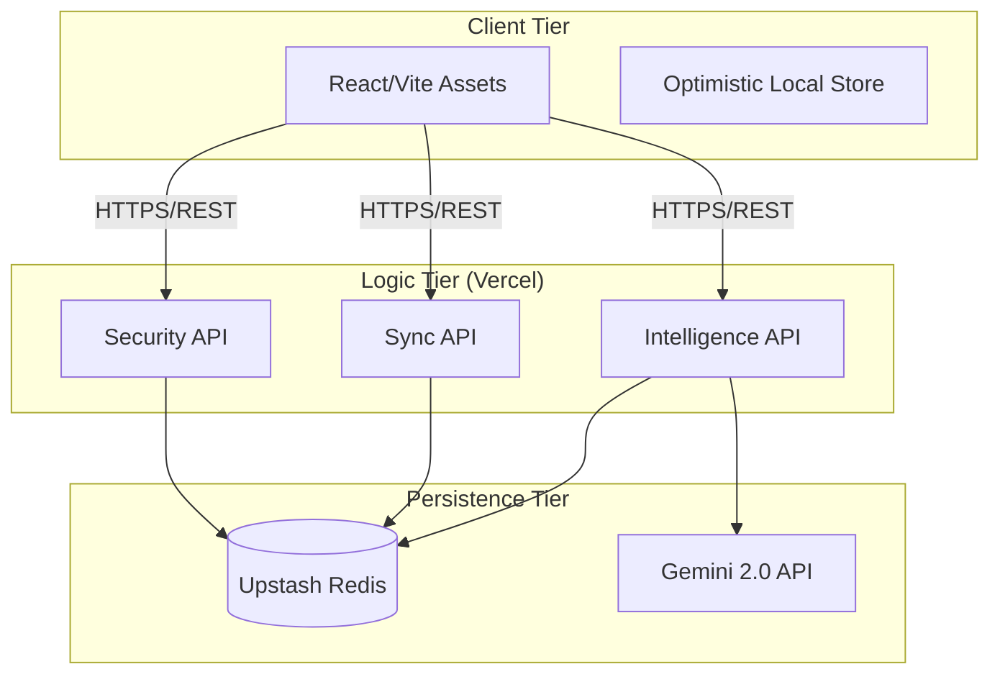

# Finflex: GenZ Financial Wingman Overview

Finflex is an AI-driven, gamified financial management ecosystem designed specifically for the Indian student demographic. This wiki provides a technical breakdown of the architecture, security models, and the intelligence layer that powers the "FinZ" persona.

---

## On this page
- [Overview](#overview)
- [Project Structure](#project-structure)
- [Architecture & Monorepo](#architecture--monorepo)
- [Authentication & Security](#authentication--security)
- [Intelligence Layer: FinZ](#intelligence-layer-finz)
- [Data Persistence Layer](#data-persistence-layer)
- [Development Workflow](#development-workflow)

---

## Overview

Finflex addresses the "frictionless trap" of digital payments in India. With over 100 billion UPI transactions annually, students often lose track of micro-spending. Finflex provides a "Financial Wingman" experience by combining real-time tracking with prescriptive AI advice and social-competitive gamification.

*Figure 1: The main dashboard featuring glassmorphic UI and real-time expense analysis.*

---

## Project Structure

The project follows a modular Node.js/Vite layout, optimized for serverless deployment on [Vercel](https://vercel.com).

- `App.tsx`: The core entry point for the React frontend, managing global state and routing.
- `AuthOverlay.tsx`: Handles the complex two-step verification UI logic.
- `api/`: Contains Vercel Serverless Functions for backend logic.
  - `api/auth.ts`: Authentication gateway logic.
  - `api/data.ts`: User data synchronization (Transactions, Goals).
  - `api/social.ts`: Social graph and leaderboard management.
  - `api/finz-chat.ts`: The AI interaction bridge.
- `package.json`: Manages dependencies including `framer-motion`, `lucide-react`, and `jwt-decode`.

---

## Architecture & Monorepo

Finflex uses a "Decoupled Edge" architecture. The frontend maintains an optimistic local state, while the backend synchronizes asynchronously with a global Redis store.

The system is designed to minimize latency by leveraging edge-cached functions and a high-performance NoSQL backbone via [Upstash Redis](https://upstash.com).

---

## Authentication & Security

Security is centered around a robust **Two-Step Verification (TSV)** system. We avoid password-only models to protect student financial data from credential stuffing attacks.

### TSV Workflow
1.  **Phase 1**: Initial credentials check using `bcrypt.js` for password hashing.
2.  **Phase 2**: Generation of a 6-digit OTP, stored in Redis with a 5-minute TTL.
3.  **Delivery**: Secure SMTP delivery via `nodemailer` using university-verified Gmail gateways.

*Figure 2: The activity and security management interface.*

File Reference: `api/auth.ts` implements the `SETEX` logic for OTP persistence and the JWT signing process.

---

## Intelligence Layer: FinZ

The "FinZ" persona is a context-aware AI agent that interprets user spending patterns. Unlike standard trackers, FinZ provides **Prescriptive Advice**.

### Context Loading Logic
When a user interacts with `api/finz-chat.ts`, the system injects the following context into the LLM prompt:
- Recent transaction history (last 30 events).
- Active Goals (e.g., "Trip to Goa").
- Current budget variance analysis.

*Figure 3: Interacting with the FinZ AI wingman for personalized budget advice.*

The AI operates in three tonal modes:
1.  **Warning**: For budget breaches.
2.  **Tip**: Behavioral nudges (e.g., "The latte factor").
3.  **Flex**: Rewards for hitting savings milestones.

---

## Data Persistence Layer

Data is modeled to be "Edge-Ready." Rather than complex relational joins, we store user profiles as flat JSON hashes in `Redis`.

### Schema Design
- `user:{id}:profile`: Stores core user settings.
- `user:{id}:transactions`: A list of spending events with metadata.
- `user:{id}:goals`: Progress tracking for specific saving targets.

*Figure 4: Real-time goal progress tracking and visualization.*

File Reference: `api/data.ts` handles the `HGETAll` and `HSET` operations to ensure zero-latency synchronization between the client and the cloud.

---

## Behavioral Economics & Gamification

To solve the "Gratification Problem," we use **Social-Competitive Gamification**.

- **Savings Streaks**: Calculated in `api/social.ts`, tracking daily budget adherence.
- **Global Leaderboard**: Uses Redis `ZSET` (sorted sets) to rank users by their "Financial Discipline Score."

*Figure 5: The Social Circles interface featuring peer comparison and leaderboard rankings.*

---

## Development Workflow

### Build & Deploy
The project uses `vite` for localized development and `vercel cli` for production pushes.

1.  **Local Dev**: `npm run dev` starts the frontend and local API runtime.
2.  **Environment Sync**: Secrets are managed in `.env.local` and mirrored in the Vercel Dashboard.
3.  **Deployment**: Automatic CI/CD triggers on git push to the `main` branch.

File Reference: `vercel.json` defines the routing and security headers for the serverless deployment.

---

## Conclusion

Finflex demonstrates that high-end technical architecture can be used to solve everyday social problems like financial literacy. By combining a "Google Code Wiki" aesthetic with deep engineering in serverless states and AI context injection, we have built more than just an app; we've built a scalable financial ecosystem.

---
*Generated for the GenZ Financial Empowerment Initiative.*
