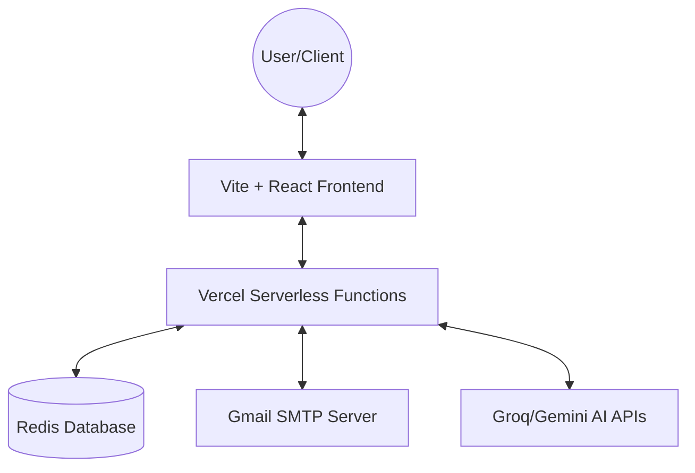
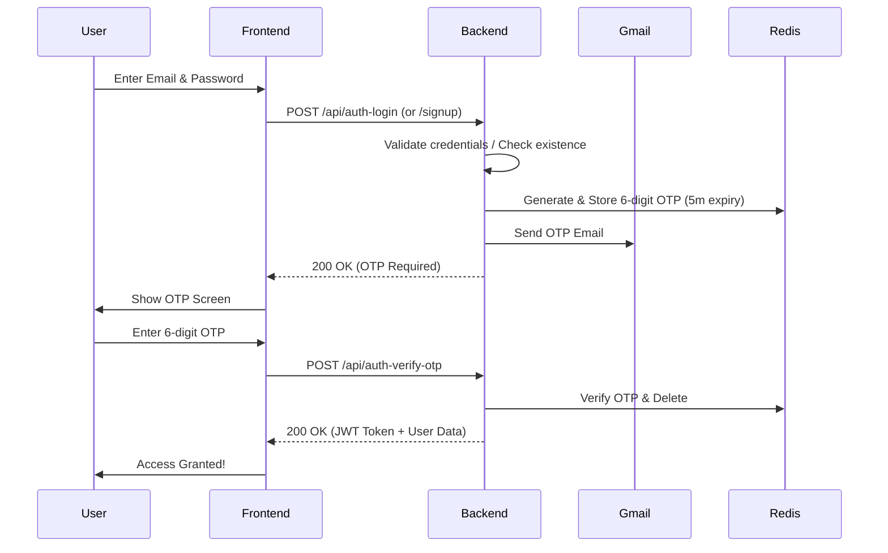
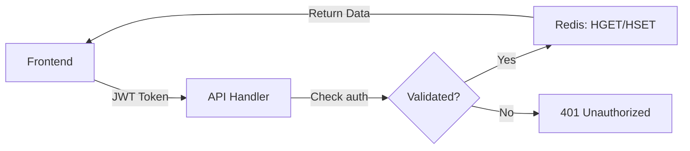

# Finflex Documentation

Welcome to the official documentation for **Finflex: The GenZ Financial Wingman**. This document provides a technical overview of the project, its architecture, and how to get started.

---

## 🏗️ Architecture Overview

Finflex is built with a modern **Serverless Architecture**, ensuring scalability and ease of deployment.



### Tech Stack
- **Frontend**: React, TypeScript, Vite, Framer Motion (animations), Lucide React (icons).
- **Backend**: Node.js, Vercel Serverless Functions.
- **Database**: Redis (managed via Upstash or local instance).
- **Security**: JWT (JSON Web Tokens), Bcrypt.js (password hashing).
- **Email**: Nodemailer (Gmail SMTP).

---

## 🔒 Authentication Flow

We use a high-security **Two-Step OTP (One-Time Password)** system for both Signup and Login.

### Flow Chart


---

## 📊 Data Persistence

All user statistics, transactions, and goals are persisted in **Redis**.

1.  **Request**: Frontend sends an auth token in the `Authorization` header.
2.  **Verification**: Backend verifies the JWT.
3.  **Operation**:
    - **GET**: Backend fetches the JSON object from Redis.
    - **POST**: Backend updates the JSON object in Redis.



---

## 🚀 API Reference

### Authentication
- `POST /api/auth-signup`: Start registration.
- `POST /api/auth-login`: Start login.
- `POST /api/auth-verify-otp`: Securely verify OTP and receive JWT.
- `GET /api/auth-me`: Get current user info (requires token).

### User Data
- `GET /api/user-data`: Fetch transactions, goals, and autopays.
- `POST /api/update-user-data`: Sync current local state to the cloud.

### Social & Competitive
- `GET /api/resolve-friend-code`: Find a user by their unique code.
- `POST /api/update-friends`: Add/remove friends.
- `GET /api/leaderboard`: Compete with friends on financial streaks.

### AI Features (FinZ)
- `POST /api/finz-chat`: Chat with the AI about your finances.
- `POST /api/finz-advice`: Get 3 automated tips based on your trends.

---

## 🛠️ Local Setup

1.  **Clone the Repo**:
    ```bash
    git clone <your-repo-url>
    ```
2.  **Install Dependencies**:
    ```bash
    npm install
    ```
3.  **Configure `.env.local`**:
    Create a `.env.local` file with the following keys:
    - `REDIS_URL`: Your Redis connection string.
    - `JWT_SECRET`: A secure random string for signing tokens.
    - `EMAIL_USER`: Your Gmail address.
    - `EMAIL_PASS`: Your 16-character Google App Password.
    - `GEMINI_API_KEY` (Optional): For AI features.
4.  **Run Development Server**:
    ```bash
    npm run dev-all
    ```

---

## 🌍 Deployment

The project is optimized for **Vercel**.
1.  Connect your GitHub repo to Vercel.
2.  Add all environment variables to the **Vercel Dashboard**.
3.  Vercel will automatically detect the `api/` directory and deploy them as Serverless Functions.
